# Replica Board Game Implementation
## FEUP - Functional and Logic Programming (PFL) 2024/2025

### Group Information
| Name             | Student Number | Contribution % | Tasks Performed |
|------------------|---------------|----------------|-----------------|
| Gonçalo Guedes da Conceição | up202206456 | 50% | Get piece based on move, Choose move, Valid moves, Move validation, White Player 1 move validation, Game Over, PC level 1 and level 2 implementation, Value |
| Gonçalo de Abreu Matias | up202108703 | 50% |  Menu Implementation, Board Implementation, Display game, Choose move, Move validation, Black Player 2 move validation, King pieces capture, Game Over, Transform Friend piece into king, README, Intermediate and near-final game states for demo |

### Installation and Execution
#### Windows
1. Install SICStus Prolog 4.9 following the official installation guide
2. Navigate to the game directory
3. Launch SICStus Prolog
4. Consult the main game file: `consult('game.pl').`
5. Start the game by typing: `play.`

#### Linux
1. Install SICStus Prolog 4.9 using your distribution's package manager
2. Follow the same steps 2-5 as Windows

### Game Description
Replica is a strategic two-player board game played on an 8x8 chessboard. The game combines elements of checkers with unique movement and transformation mechanics.

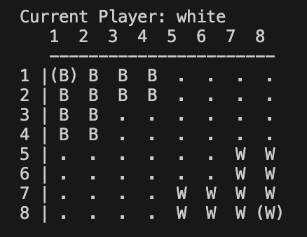
*Figure 1: Initial Game Board*

#### Basic Rules
- Players start with 12 pieces each (11 regular pieces and 1 king)
- Pieces move in three ways:
  1. Step: One square forward
  2. Jump: Multiple squares over friendly pieces
  3. Transform: Convert regular piece to king

#### Victory Conditions
- Moving a king to the opponent's corner

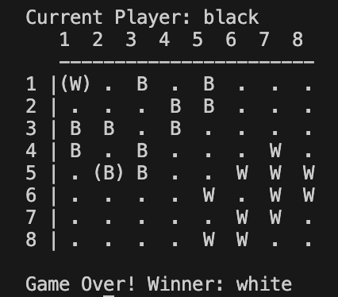
*Figure 2: First victory condition*

- Capturing the opponent's king (any)

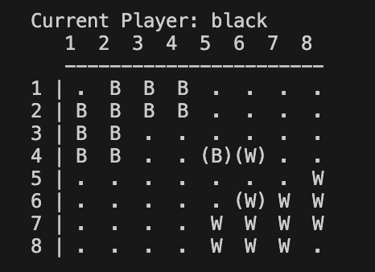
*Figure 3: Second victory condition*

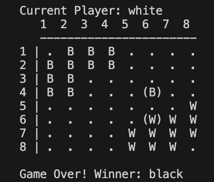
*Figure 4:  Victory*


#### Information Sources
- [Replica on Board Game Geek](https://boardgamegeek.com/boardgame/427267/replica)
- Official documentation from designer

### Game Extension Considerations
1. **Variable Board Sizes**
   - Current implementation uses 8x8 board
   - Code structured to allow future board size modifications
   - Movement calculations independent of board size

2. **Optional Rules**
   - Framework in place for additional king powers
   - Simplified ruleset for beginners possible
   - Advanced rules for experts can be added

### Game Logic
#### Game Configuration Representation
The game configuration is represented using the following structure:
```prolog
state(Board, Player, GameConfig)
```
- Board: 8x8 matrix representing the game board
- Player: current player (white/black)
- GameConfig: game mode and AI configuration

#### Internal Game State Representation
Pieces are represented as:
- `empty`: Empty square
- `w`: White piece
- `b`: Black piece
- `wk`: White king
- `bk`: Black king

#### Example Game States
Here are examples of different game states showing how the board is represented internally:

1. Initial State
```prolog
[
    [bk,b,b,b,empty,empty,empty,empty],
    [b,b,b,b,empty,empty,empty,empty],
    [b,b,empty,empty,empty,empty,empty,empty],
    [empty,empty,empty,empty,empty,empty,empty,empty],
    [empty,empty,empty,empty,empty,w,w,w],
    [empty,empty,empty,empty,w,w,w,w],
    [empty,empty,empty,empty,w,w,w,wk]
]
```

2. Intermediate State (After Several Moves)
```prolog
[
    [bk,b,empty,b,empty,empty,empty,empty],
    [b,empty,b,b,empty,empty,empty,empty],
    [b,b,empty,empty,empty,w,empty,empty],
    [empty,empty,empty,empty,empty,empty,empty,empty],
    [empty,empty,empty,empty,empty,w,w,empty],
    [empty,empty,empty,empty,w,w,empty,w],
    [empty,empty,empty,empty,w,empty,w,wk]
]
```

3. Final State (White Wins by King Capture)
```prolog
[
    [empty,b,empty,b,empty,empty,empty,empty],
    [b,empty,b,b,empty,empty,empty,empty],
    [b,b,empty,empty,empty,w,empty,empty],
    [empty,empty,empty,empty,empty,empty,empty,empty],
    [empty,empty,empty,empty,empty,w,w,empty],
    [empty,empty,empty,empty,w,w,empty,w],
    [empty,empty,empty,empty,w,empty,w,wk]
]
```

#### Move Representation
Moves are represented as:
```prolog
(PieceRow, PieceColumn, Direction)
```
- PieceRow, PieceColumn: Coordinates (1-8)
- Direction: 'H' (Horizontal), 'V' (Vertical), 'D' (Diagonal), 'T' (Transform)
- To use Transform a king has to be selected before, and then it will be asked for the coordinates of the piece to transform

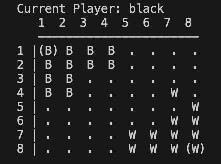
*Figure 5: Game Horizontal Feature*

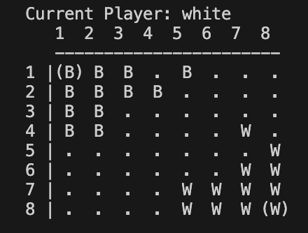
*Figure 6: Game Horizontal Feature*

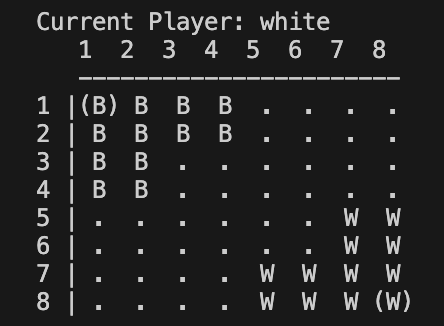
*Figure 5: Game Vertical Feature*

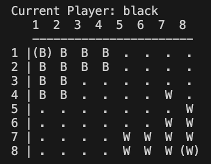
*Figure 6: Game Vertical Feature*

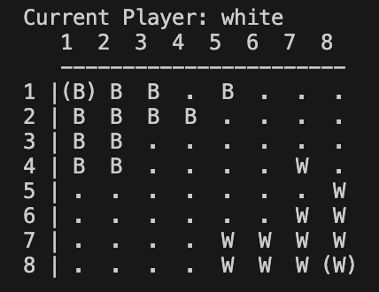
*Figure 7: Game Diagonal Feature*

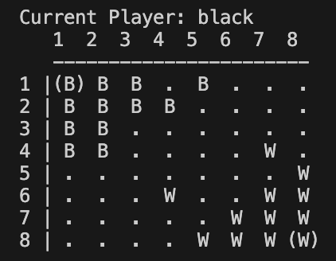
*Figure 8: Game Diagonal Feature*

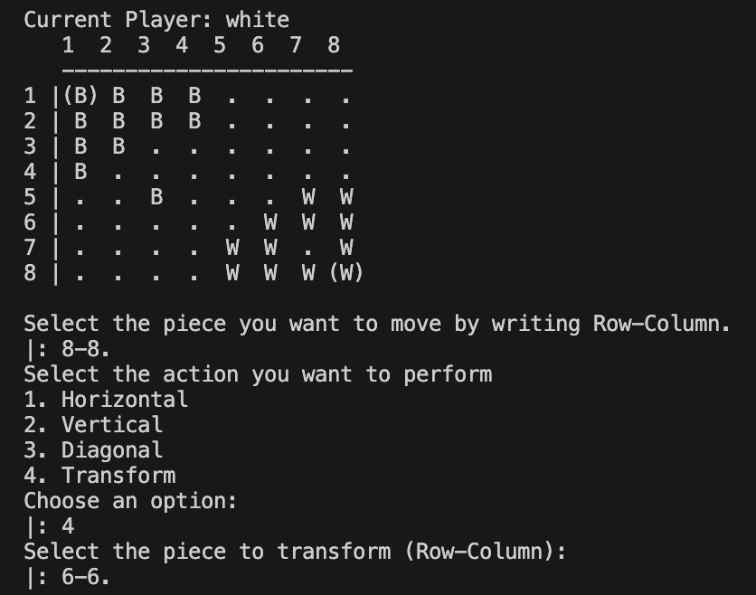
*Figure 9: Game Transform Feature*

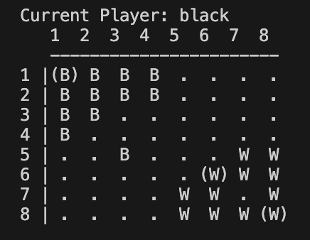
*Figure 10: Game Transform Feature*

#### User Interaction
- Menu-driven interface with clear options
- Input validation for:
  - Menu selections (1-4)
  - Move coordinates (1-8)
  - Movement direction
- Error messages for invalid inputs
- Board visualization after each move

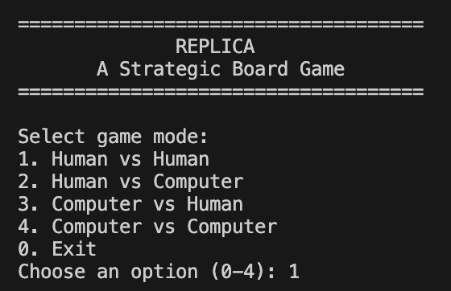
*Figure 11: Initial Game Menu*

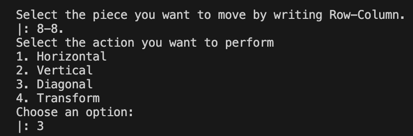
*Figure 12: Game Menu Human-Human Move*

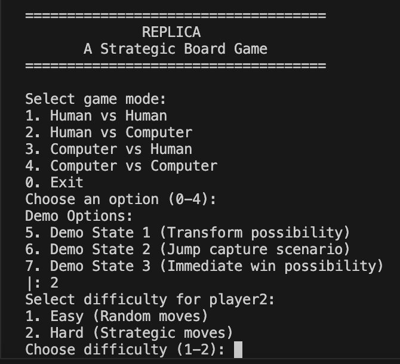
*Figure 13: Game Menu Human-Computer*

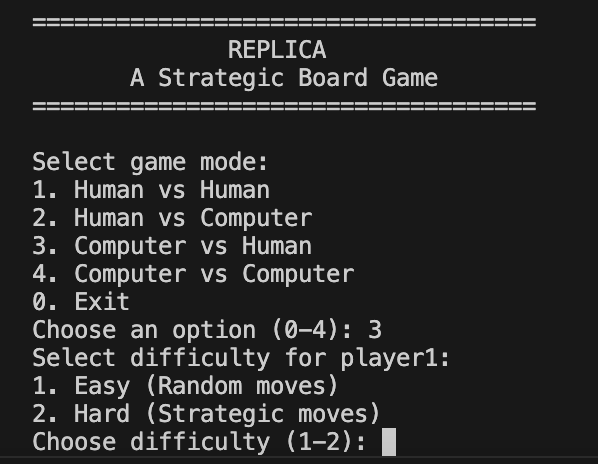
*Figure 14: Game Menu Computer-Human*

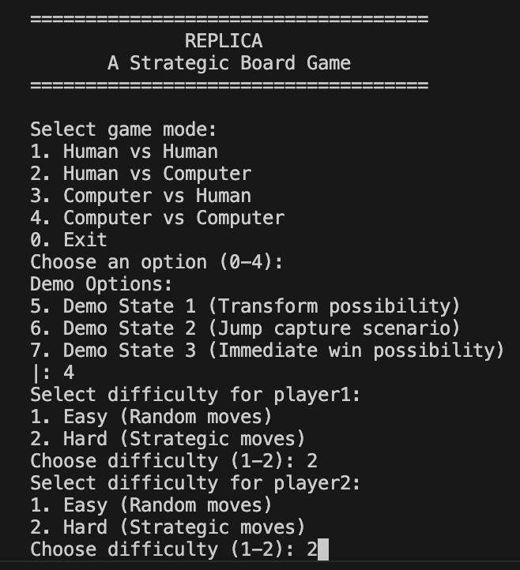
*Figure 15: Game Menu Computer-Computer*

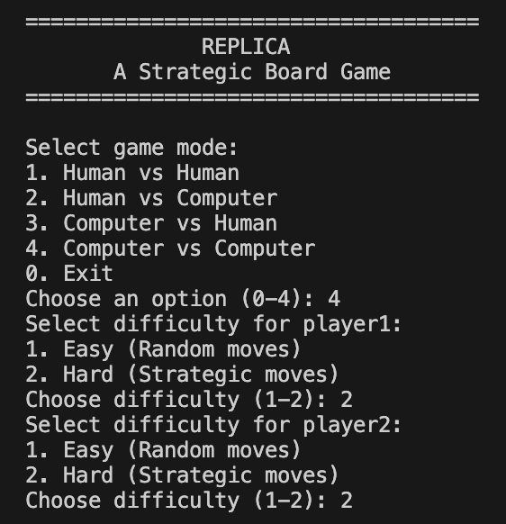
*Figure 16: Game Menu Computer-Computer*

### Conclusions
#### Current Limitations
- Basic AI implementation
- Limited undo/redo functionality
- No game state saving

#### Future Improvements
1. Enhanced AI with deeper strategic thinking, that also focus on placing the king on the opposite corner and can avoid places where pieces can be captured
2. GUI implementation

### Bibliography
1. [SICStus Prolog Documentation](https://sicstus.sics.se/documentation.html)
2. [Replica Board Game Official Rules](https://boardgamegeek.com/boardgame/427267/replica)